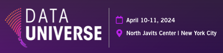

# Data Universe 2024 Workshops

This project contains information about, and artifacts for, the first 4 [Data Universe 2024 Workshops](https://www.datauniverseevent.com/en-us/experience-and-learn/workshops.html).

1. [Build Your Own Data Lakehouse](./workshop1/README.md)
2. [Understanding Modern Table Formats](./workshop2/README.md)
3. [Build SQL Data Pipelines and Data Products](./workshop3/README.md)
4. [Build Python Data Pipelines and Data Products](./workshop4/README.md)

## NOTE: Starburst Galaxy has a new UX

See more at https://www.starburst.io/blog/new-ux-starburst-galaxy/

This means you should expect some of the screenshots in the labs to look slightly different!! 