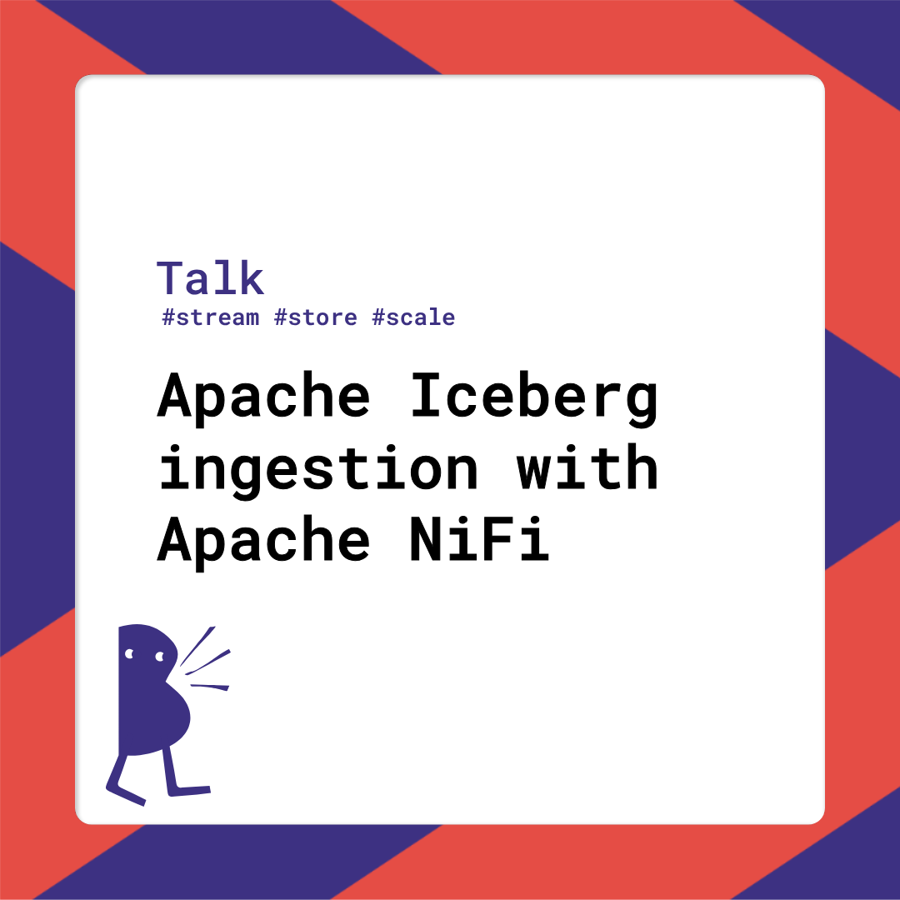
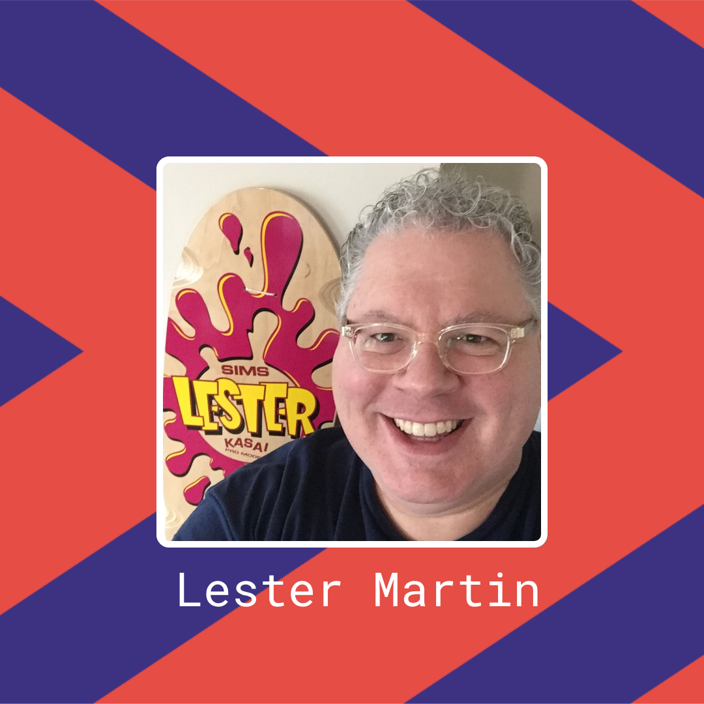
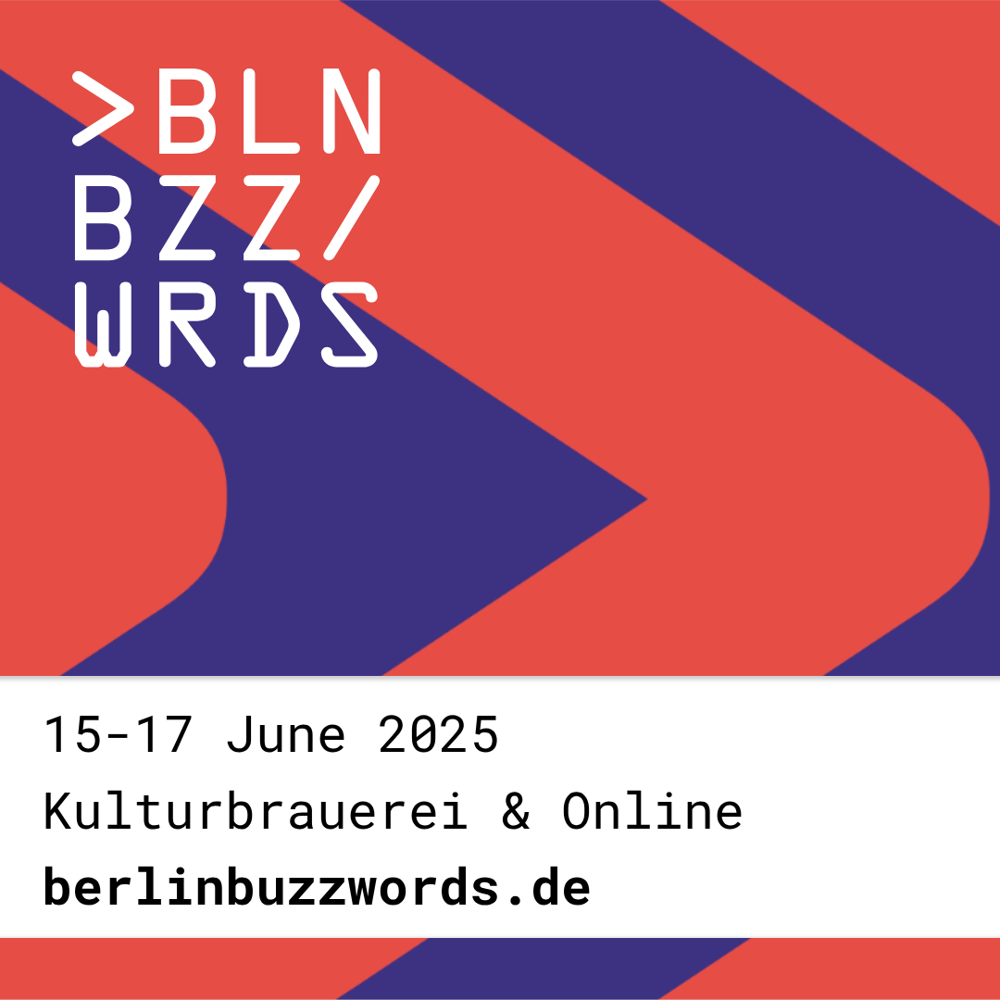

# Apache Iceberg ingestion with Apache NiFi - June 16, 2025

Excited to be presenting my [Apache Iceberg ingestion with Apache NiFi](https://2025.berlinbuzzwords.de/session/apache-iceberg-ingestion-with-apache-nifi/) session in Berlin
which includes some simple demos to go with the talk and visuals.

The presentation deck and source code are in this folder if you are interested. The official recording of my session is below...

If new to Apache NiFi, check out my [Intro to Apache NiFi flow development](https://learn-with-lester.freesite.online/tutorials/flow-dev-intro/) 
tutorial.

If interested in my blog posts on Apache Iceberg, you can find them on [lestermartin.blog](https://lestermartin.blog/tag/iceberg/).

